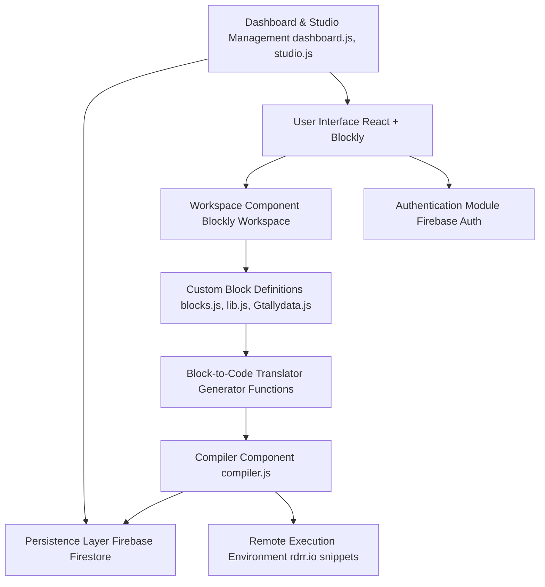

## R-Blocks 2.0

This page has a globally deployed web-application which helps folks learn R by an interactive Block-Based interface using the API integration of Google Blockly and rdrr.io with the support of HTML/CSS, JavaScript and ReactJS prepared by Dhyey Mavani'25 and Liam Davis '27 under instruction of Professor Shu-Min Liao and Dr. Andy Anderson.

Technologies used: 
- *Amherst College IT Department: https://www.amherst.edu/offices/it*
- *Google Blockly: https://developers.google.com/blockly/*
- *rdrr.io API: https://rdrr.io/* for R Console

## Architecture



The above flowchart shows the high-level architecture of R-Blocks:
- User interface built with React and Blockly
- Custom block definitions for R statistical operations
- Compilation pipeline to convert blocks to R code
- Remote execution through rdrr.io
- Data persistence using Firebase
- Authentication and user management

## Contributing

### Setup
1. Fork and clone the repository
```bash
git clone <your-repository-url>
cd r-blocks/
```

2. Install dependencies:
```bash
npm install
```

3. Configure Firebase (optional - for authentication and data persistence):
   - Create a new Firebase project at https://console.firebase.google.com/
   - Enable Authentication and Firestore Database
   - Copy `.env.example` to `.env.local` and fill in your Firebase configuration
   - Or replace the configuration directly in `src/firebase.js`

### Development
1. Start the development server:
```bash
npm start
```

2. Make your changes and test them locally

4. Build the project to verify it compiles:
```bash
npm run build
```

### Local Development
To run the project locally:
```bash
npm start
```

The application will open at http://localhost:3000

### Firebase Setup (when ready to deploy)
1. Install Firebase CLI: `npm install -g firebase-tools`
2. Login to Firebase: `firebase login`
3. Initialize your project: `firebase init`
4. Deploy: `firebase deploy`

### Pull Request Process
1. Create a new branch for your feature:
```bash
git checkout -b github_username/your-feature-name
```

2. Run the pre-commit hooks:
```bash
git add .
npm run format
git add .
```

To check if your code meets style guidelines, run:
```bash
npm run format:check
```

3. Commit your changes with descriptive messages:
```bash
git commit -m "Add: description of your changes"
git push --set-upstream origin branch-name
```

3. Push to your fork and submit a pull request

### Development Guidelines
- Follow the existing code style and structure.
- Test your changes thoroughly, both through unit tests and by running the application locally.
- Update documentation for your new feature.
- Keep pull requests focused on a single feature or fix. General rule of thumb is 150-200 lines per PR.